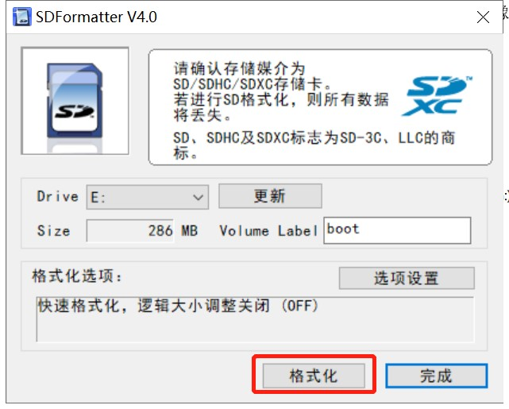
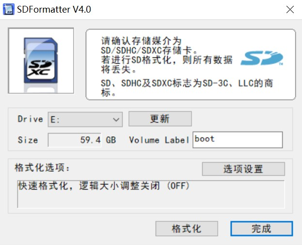
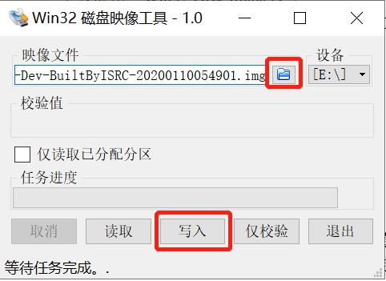
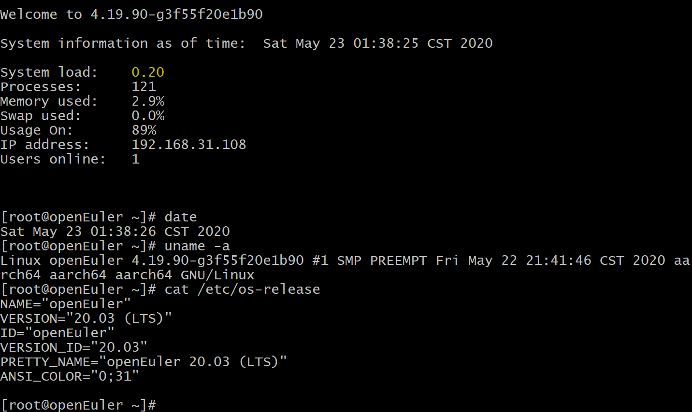

+++
title = "openEuler 跑到树莓派上"
date = "2020-05-25"
tags = ["Raspberry Pi", "summer2020", "操作系统移植"]
archives = "2020-05"
author = "woqidaideshi"
summary = "openEuler Raspberry Pi 版本镜像的构建、使用"
+++

# 概要

树莓派由英国“Raspberry Pi 基金会”开发，类似微型计算机，价格便宜，体积小，具有电脑的所有基本功能。自2012年以来，几乎每年都有新的版本发布，而且配置有了很大提升。树莓派从最初只做主板，到现在已经慢慢增加了周边的设备，包括显示器、摄像头以及一些传感器等。树莓派40针接口作为一个开放接口，提供了很大开发空间。作为开源硬件领域的一个较为高阶的硬件产品，树莓派近年来得到了越来越的开发者和专业人士的追捧。

为了降低 openEuler 使用门槛，促进用户推广，让大家尽快体验并使用 openEuler，本文将介绍如何将 openEuler 移植到树莓派。

本文主要包括三部分：

- [刷写镜像](#刷写镜像)
- [使用树莓派](#使用树莓派)
- [构建镜像](#构建镜像)

本文内容参考自 [openEuler-RaspberryPi](https://gitee.com/openeuler/raspberrypi)。如有疑问，欢迎大家在本文提交评论或者在 [openEuler-RaspberryPi](https://gitee.com/openeuler/raspberrypi) 提交 issue。

# 刷写镜像

## 实验环境

- Windows10/Linux/Mac
- 树莓派 3B/3B+/4B
- 16G 以上的 Micro SD 卡

## 获取树莓派 img 镜像

下载适配树莓派的最新 openEuler 镜像，也可以参照 [构建镜像](#构建镜像) 定制自己的 openEuler 树莓派镜像，下面以 `XXX.img` 表示该镜像。

当前最新的 openEuler 20.03 LTS 的内测版本镜像，[下载](https://isrc.iscas.ac.cn/EulixOS/repo/dailybuild/1/isos/20200508/openEuler_20200508151847.img.xz)。

该镜像的基本信息：

- [更新日志](https://gitee.com/openeuler/raspberrypi/blob/master/documents/changelog.md)
- 发布时间：2020-05-11
- 大小：245 MiB
- 操作系统版本：openEuler 20.03 LTS
- 内核版本：4.19.90-2003.4.0.0036
- 固件来源：[firmware](https://github.com/raspberrypi/firmware)、[bluez-firmware](https://github.com/RPi-Distro/bluez-firmware)、[firmware-nonfree](https://github.com/RPi-Distro/firmware-nonfree)
- 构建文件系统的源仓库：[openEuler-20.03-LTS](http://repo.openeuler.org/openEuler-20.03-LTS/everything/aarch64/)
- 镜像内置源仓库：[openEuler 20.03 LTS 源仓库](https://gitee.com/openeuler/raspberrypi/blob/master/scripts/config/openEuler-20.03-LTS.repo)

发布的镜像更新情况参见 [openEuler-RaspberryPi](https://gitee.com/openeuler/raspberrypi/blob/master/README.md)。

## 刷写 SD 卡

可以在 Windows、Linux、Mac 环境下的刷写 SD 卡，详见 [刷写镜像](https://gitee.com/openeuler/raspberrypi/blob/master/documents/刷写镜像.md)。

下面我们以 Windows 环境为例，介绍如何将镜像刷写到 SD 卡。

### 格式化 SD 卡

下载应用：SDFormater，用于格式化 SD 卡。

若 SD 卡之前未安装过镜像，盘符正常只有一个，选择 SD 卡对应盘符，直接格式化即可；

若 SD 卡之前安装过镜像，盘符会有三个，选择 SD 卡对应盘符（图例中为 E: 盘），格式化即可：

### 写入 SD 卡

下载应用：Win32 Disk Imager。

右键选择“以管理员身份运行”，打开 Win32 Disk Imager，选择镜像 img 文件和待写入的 SD 卡，点击【写入/Write】。

写入完成即可。

写入成功后，SD 卡自动分区后的盘符为：

# 使用树莓派

## 启用树莓派

版本要求：树莓派 3B/3B+/4B。

默认用户名：root，密码：openeuler。

将刷好的 SD 卡插入树莓派，通电启用。树莓派正常启动，还需连接网线至局域网。

由于使用树莓派时，大多都使用 ssh 远程连接；在树莓派启动联网时，无法得知其 IP 地址。

有以下两种方式：

1. 本地登录

将树莓派连接显示器（树莓派视频输出接口为 Micro HDMI）、键盘、鼠标后，启动树莓派，可以看到树莓派启动日志输出到显示器上。待树莓派启动成功，输入用户名（root）和密码（openeuler）登录。目前，openEuler 系统无桌面环境，添加桌面支持相关进度可关注 [期望增加桌面支持](https://gitee.com/openeuler/raspberrypi/issues/I1F21F)，欢迎大家参与。

登录成功后，树莓派即显示本机相关信息，包括本机 IP。如下图（ssh 登录也显示这些信息）：

2. ssh 远程登录

如果树莓派连接已知路由器，可登录路由器管理，新增的 IP 即为树莓派 IP：

从上图看到，树莓派对应 IP 为：192.168.1.102，使用命令 `ssh root@192.168.1.102` 后输入密码 `openeuler`，即可远程登录树莓派。

## 根目录分区扩展

默认根目录分区空间比较小，在使用之前，需要对分区进行扩容。详情参见 [根目录分区扩展
](https://gitee.com/openeuler/raspberrypi/blob/master/documents/树莓派使用.md#根目录分区扩展)。

## wifi 连接

wifi 使用详情参见 [wifi 连接
](https://gitee.com/openeuler/raspberrypi/blob/master/documents/树莓派使用.md#wifi-连接)。

## 音频

音频使用详情参见 [音频
](https://gitee.com/openeuler/raspberrypi/blob/master/documents/树莓派使用.md#音频)。

## 蓝牙

蓝牙使用详情参见 [蓝牙
](https://gitee.com/openeuler/raspberrypi/blob/master/documents/树莓派使用.md#蓝牙)。

## GPIO

GPIO 使用详情参见 [GPIO
](https://gitee.com/openeuler/raspberrypi/blob/master/documents/树莓派使用.md#GPIO)。

# 构建镜像

可以根据需要定制内核，构建镜像。详细内容请参考 [openEuler 镜像的构建](https://gitee.com/openeuler/raspberrypi/blob/master/documents/openEuler镜像的构建.md)。

主要过程包括：

1. 准备环境
2. 编译内核
3. 准备树莓派固件和应用
4. 制作 openEuler 的 rootfs
5. 制作镜像

## 准备环境

- 操作系统：openEuler；
- 架构：AArch64；
- 硬盘存储不低于 50G；
- 内存不低于 2G；
- 可访问外网。

可以通过以下方式获取 AArch64 架构的运行环境：

- 使用 AArch64 架构的主机，例如刷写 openEuler 镜像的树莓派 3B/3B+/4B
- 使用 [QEMU](https://www.qemu.org/) 模拟器搭建 AArch64 运行环境

## 编译内核

除了使用 AArch64 架构的 openEuler 或 Centos 7/8 运行环境，也可以采用交叉编译的方式编译内核，文档详见 [交叉编译内核](https://gitee.com/openeuler/raspberrypi/blob/master/documents/交叉编译内核.md)。

用户可以根据需要定制自己的内核，内核编译过程详见 [编译内核](https://gitee.com/openeuler/raspberrypi/blob/master/documents/openEuler镜像的构建.md#编译内核)。

## 准备树莓派固件和应用

过程详见 [树莓派固件和应用](https://gitee.com/openeuler/raspberrypi/blob/master/documents/openEuler镜像的构建.md#树莓派固件和应用)。

树莓派固件：

- [firmware](https://github.com/raspberrypi/firmware)
- [bluez-firmware](https://github.com/RPi-Distro/bluez-firmware)
- [firmware-nonfree](https://github.com/RPi-Distro/firmware-nonfree)

树莓派应用：

- [pi-bluetooth](https://github.com/RPi-Distro/pi-bluetooth)

## 制作 openEuler 的 rootfs

过程详见 [制作 openEuler 的 rootfs](https://gitee.com/openeuler/raspberrypi/blob/master/documents/openEuler镜像的构建.md#制作-openeuler-的-rootfs)。

使用 rpm 命令制作 openEuler 的 rootfs，并为 rootfs 安装 NetworkManager、openssh-server、 passwd 等必要软件，设置网络等。

rootfs 的基本信息：

- 操作系统版本：openEuler 20.03 LTS
- 构建文件系统的源仓库：[openEuler-20.03-LTS](http://repo.openeuler.org/openEuler-20.03-LTS/everything/aarch64/)
- 镜像内置源仓库：[openEuler 20.03 LTS 源仓库](https://gitee.com/openeuler/raspberrypi/blob/master/scripts/config/openEuler-20.03-LTS.repo)

## 制作镜像

过程详见 [制作镜像](https://gitee.com/openeuler/raspberrypi/blob/master/documents/openEuler镜像的构建.md#制作镜像)。

主要过程包括：

1. 创建镜像文件
    1. 创建镜像后分区
    2. 格式化分区后挂载其 boot 和根目录分区
2. 完善根目录分区，需要拷贝的文件
    1. 制作的 rootfs
    2. 编译的内核模块
    3. 树莓派部分固件和应用
3. 完善 boot 分区，需要拷贝的文件
    1. 树莓派引导文件
    2. 编译的内核和设备树文件

注意，完善根目录分区时还需要根据实际情况设置 fstab 等内容，完善 boot 分区时需要根据实际需要设置 config.txt 等内容。

至此，openEuler 的树莓派镜像制作完成。发布的镜像更新情况参见 [openEuler-RaspberryPi](https://gitee.com/openeuler/raspberrypi/blob/master/README.md)。